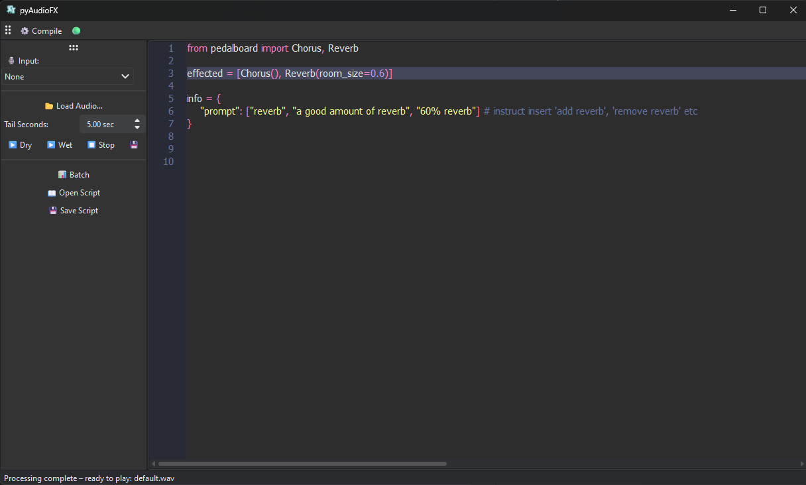

# pyAudioFX

**pyAudioFX** is a desktop application for experimenting with audio effects in Python. It provides a live-coding environment where you can write Python scripts using [Pedalboard](https://github.com/spotify/pedalboard) plugins, process audio files, batch-process folders, and even monitor live audio input with your effects in real time.

---



---

## Features

- 🎛️ **Scriptable Effects:** Write Python scripts to define your audio effect chains using Pedalboard plugins and VST3.
- 🎧 **Live Audio Preview:** Instantly preview your processed audio or the original ("dry") signal.
- 🖥️ **Live Input Monitoring:** Route your microphone or input device through your effect chain in real time.
- 📂 **Batch Processing:** Apply your effect chain to entire folders of audio files with multi-core support.
- 📝 **Syntax Highlighting:** Built-in Python editor with Dracula theme and syntax highlighting.
- 💾 **Script & Audio Management:** Open/save scripts and audio files easily.

---

## Getting Started

### Prerequisites

- Python 3.9+
- [Pedalboard](https://github.com/spotify/pedalboard)
- [PyQt6](https://pypi.org/project/PyQt6/)
- [Qsci](https://pypi.org/project/QScintilla/)
- [soundfile](https://pypi.org/project/PySoundFile/)
- [sounddevice](https://pypi.org/project/sounddevice/)
- [tqdm](https://pypi.org/project/tqdm/)
- [qdarktheme](https://pypi.org/project/qdarktheme/)
- numpy

Install dependencies:

```sh
pip install -r requirements.txt
```

### Running

```sh
python pyaudiofx.py
```

---

## Usage

1. **Write your effect chain** in the editor, e.g.:
    ```python
    from pedalboard import Chorus, Reverb
    effected = [Chorus(), Reverb(room_size=0.6)]
    ```
2. **Load an audio file** (WAV, AIFF, FLAC).
3. **Compile** your script and preview the processed ("wet") or original ("dry") audio.
4. **Enable live input** to process your microphone or input device in real time.
5. **Batch process** a folder of audio files with your effect chain.

---

## Batch Processing

- Click the **Batch** button.
- Choose a folder, set a suffix for processed files, and the number of worker threads.
- All compatible audio files in the folder (and subfolders) will be processed.

---

## Live Input

- Select your input device from the toolbar.
- Your input will be routed through your effect chain and played back in real time.
- To stop live monitoring, select "None" in the device dropdown.

---

## Saving & Loading

- **Scripts:** Use the toolbar to open/save your Python effect scripts.
- **Audio:** Load audio files for preview and processing.